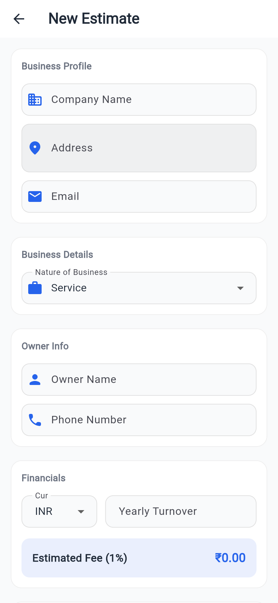
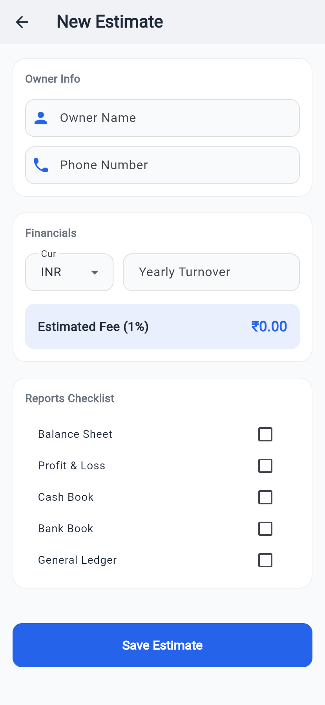

# Finora 📊✨

Finora is a premium, offline-first Flutter application designed for accounting, estimation, and fee calculations. Built with modern Material 3 aesthetics and smooth user experiences, Finora empowers professionals and businesses to create, manage, and export estimates seamlessly, with secure Firebase Cloud Synchronization for multi-device access.

---

## 📸 Screenshots

<p align="center">
  
</p>

<p align="center">
  
  &nbsp;
  
</p>

---

## 🚀 Key Features

*   **Offline-First Architecture**: Built using `sqflite` for robust local database operations. Keep working even without an internet connection.
*   **Firebase Cloud Sync**: Secure authentication and real-time/on-demand synchronization to Cloud Firestore, keeping your estimates safe and updated.
*   **Professional PDF Export**: Generate clean, print-ready PDF estimates and share or print them directly from the app.
*   **Smart Estimator**: Automatic calculation of estimated fees and percentages based on business turnovers and types.
*   **Google Sign-In & Email Authentication**: Seamless and secure onboarding flow with Firebase Auth.
*   **Modern Material 3 Design**: Features a clean typography set using the `Inter` font, subtle animations, and a rich, responsive interface.

---

## 🛠️ Technology Stack

*   **Framework**: [Flutter](https://flutter.dev/) (v3.11.0+)
*   **Local Database**: [sqflite](https://pub.dev/packages/sqflite)
*   **Cloud Platform**: [Firebase](https://firebase.google.com/) (Auth, Cloud Firestore)
*   **Document Generation**: [pdf](https://pub.dev/packages/pdf) & [printing](https://pub.dev/packages/printing)
*   **State & Design**: Material 3 & Google Fonts (`Inter`)

---

## 📂 Project Structure

```text
lib/
├── database/         # Local SQLite DB Helpers
├── models/           # Data structures and serialization
├── screens/          # Application views (Authentication, Dashboard, Details)
├── services/         # Cloud sync, Authentication, and Business Logic
├── widgets/          # Reusable UI Components
└── main.dart         # App entry point & initialization
```

---

## ⚙️ Getting Started

### Prerequisites

*   Flutter SDK installed on your machine.
*   An active Firebase project with Android/iOS apps registered.

### Local Setup

1.  **Clone the repository:**
    ```bash
    git clone https://github.com/Hetk8406/Finora.git
    cd Finora
    ```

2.  **Add Firebase Configuration:**
    *   Add your `google-services.json` to the `android/app/` directory.
    *   Add your `GoogleService-Info.plist` to the `ios/Runner/` directory.

3.  **Install dependencies:**
    ```bash
    flutter pub get
    ```

4.  **Run the application:**
    ```bash
    flutter run
    ```

---

## 📄 License

This project is licensed under the MIT License. See the LICENSE file for details.
